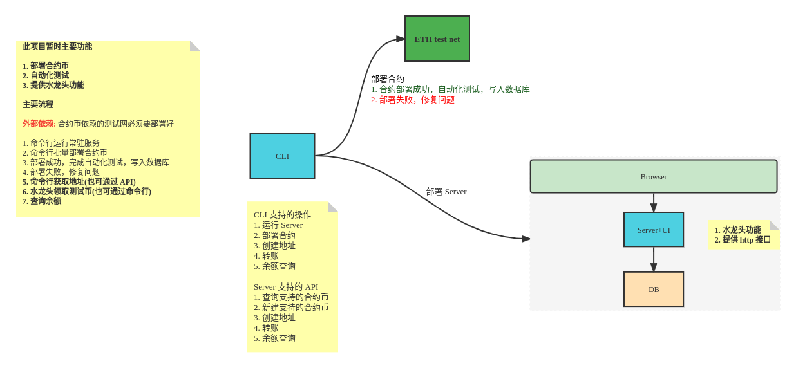

# Npool Build-Chain

[](https://github.com/NpoolPlatform/build-chain/actions/workflows/main.yml)

[目录](#目录)

- [Npool Build-Chain](#npool-build-chain)
  - [说明](#说明)
    - [新增功能](#新增功能)
  - [功能](#功能)
  - [命令](#命令)
  - [最佳实践](#最佳实践)
  - [环境变量](#环境变量)
  - [使用说明](#使用说明)

-----------


## 说明


### 新增功能
- [x] eth链交互
- [x] 快捷erc20最基础合约部署
- [ ] 水龙头功能
- [ ] 快捷erc20非proxy合约部署
- [ ] tron链交互
- [ ] filecoin链交互

## 功能
合约工具服务

- [x] 单独作为工具服务存在

## 命令

- make init ```初始化仓库，创建go.mod```
- make verify ```验证开发环境与构建环境，检查code conduct```
- make verify-build ```编译目标```
- make test ```单元测试```
- make generate-docker-images ```生成docker镜像```
- make build-chain ```单独编译服务```
- make build-chain-image ```单独生成服务镜像```
- make deploy-to-k8s-cluster ```部署到k8s集群```

## 最佳实践

- 每个服务只提供单一可执行文件，有利于 docker 镜像打包与 k8s 部署管理
- 每个服务提供 http 调试接口，通过 curl 获取调试信息
- 集群内服务间 direct call 调用通过服务发现获取目标地址进行调用

## 环境变量

| 变量名称         | 支持的值                        | 说明       |
|:-----------------|:--------------------------------|:---------|
| ENV_ETH_ENDPOINT | ip:port default(127.0.0.1:8545) | 用于server |

## 使用说明
物理机启动server端，需要配置好server使用的环境变量。
在浏览器可访问服务页面
http://ServerIP:50490/
页面上可申请已经部署且可支持的合约币


使用cli工具连接server端，部署合约
```Shell
# 查看参数
./build-chain crawl 
# 部署ethscan中erc20-top-tokens 前1-50
./build-chain crawl --host ServerIP:50491 -o 1 -l 50
# 指定公网contract进行部署
./build-chain crawl --host ServerIP:50491 --co 0xdAC17F958D2ee523a2206206994597C13D831ec7
```
部署成功的合约可访问server端的web界面申请空投
