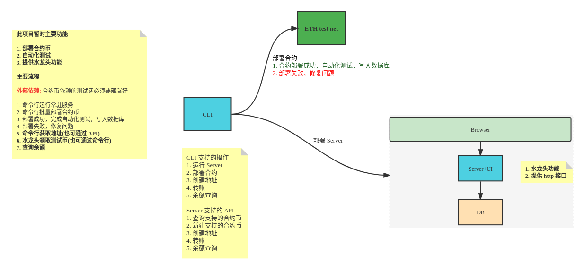
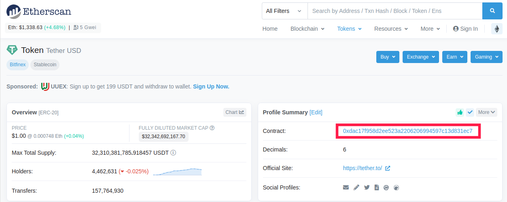
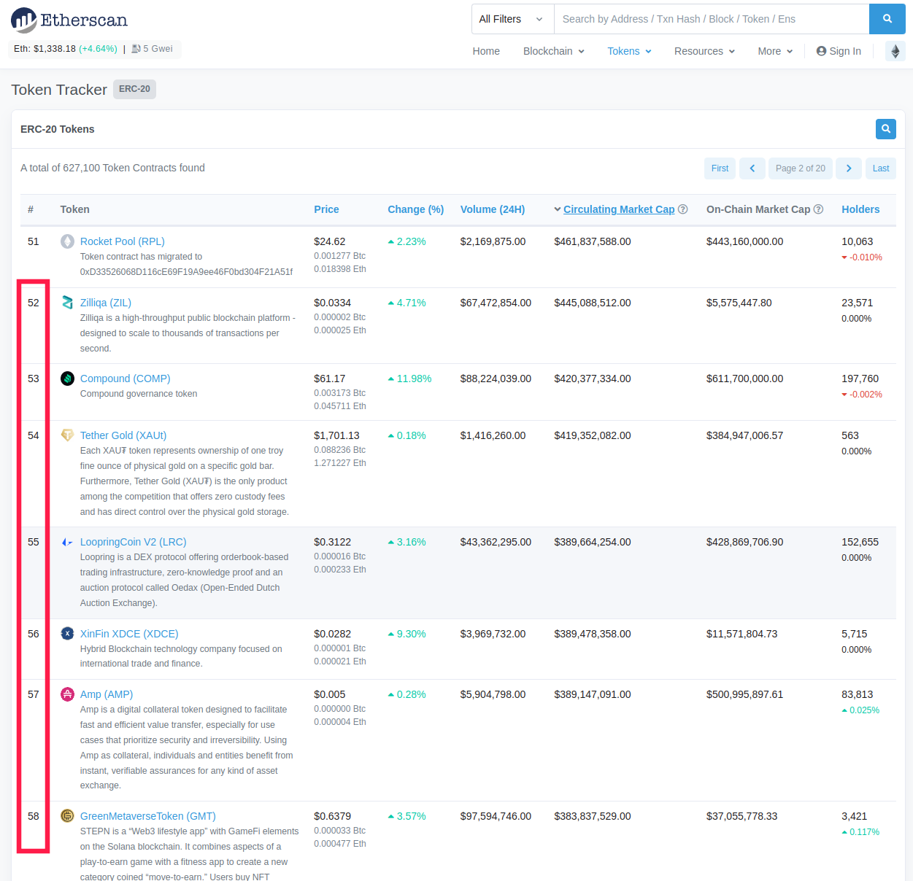

# Npool Build-Chain

[](https://github.com/NpoolPlatform/build-chain/actions/workflows/main.yml)

[目录](#目录)

- [Npool Build-Chain](#npool-build-chain)
  - [说明](#说明)
    - [新增功能](#新增功能)
  - [功能](#功能)
  - [命令](#命令)
  - [最佳实践](#最佳实践)
  - [环境变量](#环境变量)
  - [使用说明](#使用说明)
    - [docker部署](#docker部署)
    - [依赖coinbase部署方式](#依赖coinbase部署方式)
    - [部署合约](#部署合约)
    - [sphinx-plugin支持](#sphinx-plugin支持)
  - [补充](#补充)
    - [ethereum测试链启动指南](#ethereum测试链启动指南)
  - [增加合约币流程](#增加合约币流程)

-----------

## 说明


目前仅支持ethereum上的部分erc20币种（top100中支持23个币种）

### 新增功能

- [x] eth链交互
- [x] 快捷erc20最基础合约部署
- [ ] 部署erc20非proxy合约
- [ ] 部署erc20 proxy合约
- [x] 统一存入地址的大小写
- [ ] build-chain server可以不和eth-wallet部署到同一个物理环境
- [x] 基础erc20接水
- [x] eth接水
- [x] 水龙头功能
- [ ] 快捷erc20非proxy合约部署
- [ ] tron链交互
- [ ] filecoin链交互
- [ ] 自动显示账户、币种细节（web页面选中自动查询币种信息、账户信息）
- [ ] 流程上支持快速加入一个币种

## 功能

合约工具服务

- [x] 单独作为工具服务存在
- [x] 可用做cli配合已启动的服务工作

## 命令

- make init ```初始化仓库，创建go.mod```
- make verify ```验证开发环境与构建环境，检查code conduct```
- make verify-build ```编译目标```
- make test ```单元测试```
- make generate-docker-images ```生成docker镜像```
- make build-chain ```单独编译服务```
- make build-chain-image ```单独生成服务镜像```
- make deploy-to-k8s-cluster ```部署到k8s集群```

## 最佳实践

- 每个服务只提供单一可执行文件，有利于 docker 镜像打包与 k8s 部署管理
- 每个服务提供 http 调试接口，通过 curl 获取调试信息
- 集群内服务间 direct call 调用通过服务发现获取目标地址进行调用

## 环境变量

| 变量名称             | 支持的值                            | 说明       |
|:---------------- |:------------------------------- |:-------- |
| ENV_ETH_ENDPOINT | ip:port default(127.0.0.1:8545) | 必填参数-用于server |
| ENENV_INVERSTOR_KEY | privateKey | 可选参数-用于部署合约和提供水龙头手续费（请提供有一定ETH的私钥） |

## 使用说明
### docker部署
docker启动
```shell
docker run --name buildchain -p 50491:50491 -p 50490:50490 -e ENV_ETH_ENDPOINT="eth_wallet_endpoint" -e ENENV_INVERSTOR_KEY="privateKey" buildchain:test
```

G网环境启动示例
```shell
docker run --name buildchain  -p 50491:50491 -p 50490:50490 -e ENV_ETH_ENDPOINT="https://goerli.infura.io/v3/9aa3d95b3bc440fa88ea12eaa4456161" -e ENE_INVERSTOR_KEY="7a87e4528e013e533d63dd7661ead74fc3b25289652469a289bdf89b84e15c21" buildchain:test
```

注：数据目录在/data，按需挂载到物理机或传入ENV_DATA_DIR环境变量修改
### 依赖coinbase部署方式
需要在钱包机所在的环境启动server端
启动时需要配置eth测试链endpoint地址
还需要运行build-chain目录下有BuildChain.viper.yaml文件

```Shell
# --ik 全称 
./build-chain run --ee http://EthereumWalletIP:Port
```

### 部署合约
使用cli工具连接server端，使用crawl爬取ethscan.io上的合约数据，部署到测试链

```Shell
# 必要时需要设置代理
# export all_proxy=socks5://IP:PORT
# export https_proxy=socks5://IP:PORT
# export no_proxy='my_ip/netmask'
# 查看参数
./build-chain crawl 
# 1.部署ethscan中erc20-top-tokens 前1-100，大约有23个币种可以成功部署
./build-chain crawl --host ServerIP:50491 -o 1 -l 100
# 2.指定公网contract进行部署
./build-chain crawl --host ServerIP:50491 --co 0xdAC17F958D2ee523a2206206994597C13D831ec7
```

部署成功的合约可访问server端的web界面申请空投

在浏览器可访问服务页面
http://ServerIP:50490/
页面上可申请已经部署且可支持的合约币

### sphinx-plugin支持
sphinx-plugin在测试模式下启动需要build-chain server也启动（当前就eth测试环境需要），启动后查询需要的测试合约地址，当需要的合约类型不存在时会请求build-chain部署好并自动获取合约地址。

## 补充

### ethereum测试链启动指南

启动eth测试链时，需要指定http地址以及开启允许unlock
建议启动方式如下

```Shell
nohup geth --http --datadir ~/eth_node0 --dev --dev.period 1 --mine --miner.threads 2 --http.api 'eth,net,web3,miner,personal' --http.addr 0.0.0.0 --allow-insecure-unlock > ~/eth_node0/geth.log 2>&1 &

geth attach ~/eth_node0/geth.ipc
```

## 增加合约币流程

1. 启动build-chain server端

2. 打开server的web页面（浏览器访问ServerIP:50490）,可查看已有币种信息

3. 使用build-chain cli工具将ethscan.io上的合约部署到测试网
   
   + 可指定公网合约地址部署
       例如：

       ./build-chain crawl --host ServerIP:50491 --co 0xdAC17F958D2ee523a2206206994597C13D831ec7
       
   
   + 可指定ethscan批量合约部署
       例如：
       
       ./build-chain crawl --host ServerIP:50491 -o 1 -l 100
       
       ./build-chain crawl --host ServerIP:50491 -o 52 -l 7
       
